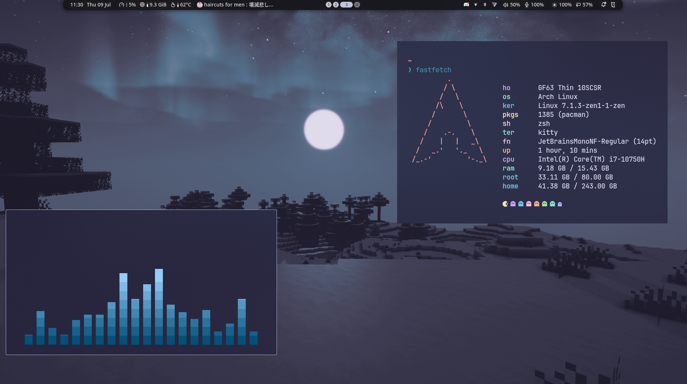
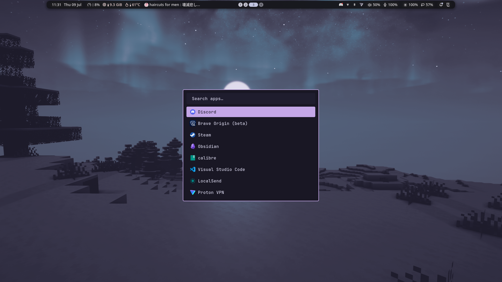
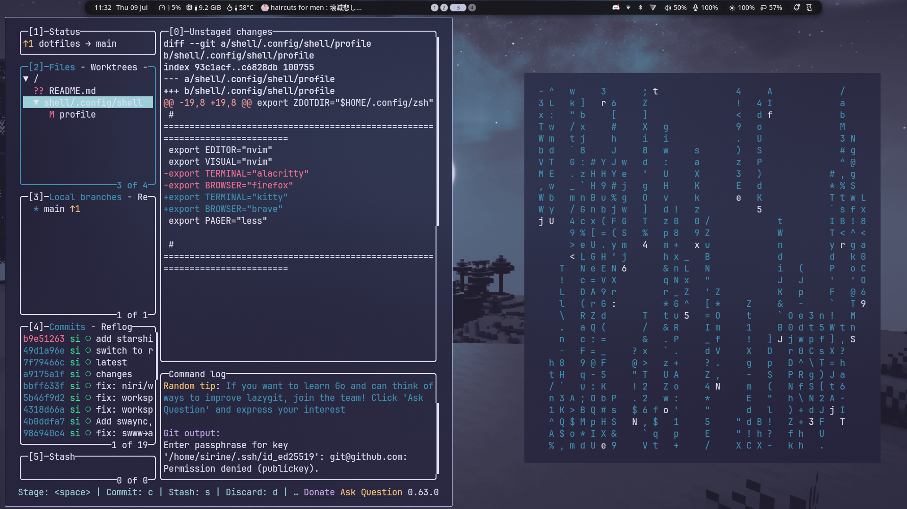

# dotfiles

Personal Arch Linux dotfiles built around the [niri](https://github.com/YaLTeR/niri) scrollable-tiling Wayland compositor, themed with [Rosé Pine](https://rosepinetheme.com/), and driven by the [Noctalia](https://github.com/Ly-sec/noctalia) desktop shell.

Configs are organized as [GNU Stow](https://www.gnu.org/software/stow/) packages so each application can be symlinked into `$HOME` independently.

## Screenshots

<!-- Add screenshots of your setup here. Suggested shots:
     - Full desktop / niri overview
     - Rofi launcher
     - Terminal + fastfetch
     - Noctalia control center / bar
     - A tiled workspace layout
-->

_Desktop_



_Launcher_



_Lazygit_



## Overview

| Component | Application | Notes |
|-----------|-------------|-------|
| Compositor | [niri](https://github.com/YaLTeR/niri) | Scrollable-tiling Wayland WM |
| Desktop shell | [Noctalia](https://github.com/Ly-sec/noctalia) | Bar, control center, launcher, wallpaper, session (v5) |
| Bar (alt) | [waybar](https://github.com/Alexays/Waybar) | Alternative status bar |
| Launcher | [rofi](https://github.com/lbonn/rofi) | App launcher, clipboard, display menu |
| Launcher (alt) | [fuzzel](https://codeberg.org/dnkl/fuzzel) | Wayland-native launcher |
| Notifications | [Noctalia](https://github.com/Ly-sec/noctalia) | Notifications handled by the shell (swaync config kept as fallback) |
| Browser | [Brave](https://brave.com/) | |
| Terminal | [alacritty](https://github.com/alacritty/alacritty) / [kitty](https://sw.kovidgoyal.net/kitty/) | Alacritty is `$TERMINAL`; kitty spawned by niri keybinds |
| Shell | [zsh](https://www.zsh.org/) | zinit, fzf-tab, zoxide, fzf, starship |
| Prompt | [starship](https://starship.rs/) / [oh-my-posh](https://ohmyposh.dev/) | Starship active |
| Editor | [neovim](https://neovim.io/) | `$EDITOR` / `$VISUAL` |
| Multiplexer | [tmux](https://github.com/tmux/tmux) | |
| File manager | [Thunar](https://docs.xfce.org/xfce/thunar/start) / [yazi](https://github.com/sxyazi/yazi) | Thunar (GUI), yazi (TUI) |
| Git TUI | [lazygit](https://github.com/jesseduffield/lazygit) | |
| System monitor | [btop](https://github.com/aristocratos/btop) | |
| Audio visualizer | [cava](https://github.com/karlstav/cava) | |
| Audio effects | [easyeffects](https://github.com/wwmm/easyeffects) | |
| PDF viewer | [Okular](https://okular.kde.org/) | zathura config also included |
| Fetch | [fastfetch](https://github.com/fastfetch-cli/fastfetch) | |
| Idle / lock | swayidle, hypridle, hyprlock | |
| Theming | GTK 3/4, Qt5ct / Qt6ct | Rosé Pine |

## Structure

Each top-level directory is a Stow package. The tree inside mirrors where files land relative to `$HOME`:

```
dotfiles/
├── alacritty/.config/alacritty/
├── btop/.config/btop/
├── cava/.config/cava/
├── easyeffects/.config/easyeffects/
├── fastfetch/.config/fastfetch/
├── fuzzel/.config/fuzzel/
├── gtk/.config/gtk-3.0/  gtk-4.0/
├── lazygit/.config/lazygit/
├── niri/.config/niri/config.kdl
├── noctalia/.config/noctalia/
├── nvim/.config/nvim/
├── ohmyposh/.config/ohmyposh/
├── qt/.config/qt5ct/  qt6ct/
├── qt6ct/.config/qt6ct/
├── rofi/.config/rofi/
├── shell/.config/shell/       # shared alias / profile / secrets
├── swayidle/.config/swayidle/
├── swaync/.config/swaync/
├── tmux/.config/tmux/
├── waybar/.config/waybar/
├── yazi/.config/yazi/
├── zathura/.config/zathura/
└── zsh/.config/zsh/           # ZDOTDIR (.zshrc, .zprofile)
```

The `shell/` package holds shell-agnostic config (`alias`, `profile`) sourced by zsh so bash/POSIX shells share it. `profile` exports XDG base dirs, `$EDITOR`, `$TERMINAL`, `$BROWSER`, toolchain paths (cargo, go, java, bun, fnm), and sets `ZDOTDIR` to `~/.config/zsh`.

## Install

Requires `git` and `stow`.

```sh
git clone https://github.com/sirinezanina/dotfiles.git ~/dotfiles
cd ~/dotfiles
```

Stow individual packages:

```sh
stow niri noctalia zsh shell nvim tmux
```

Or stow everything at once:

```sh
stow */
```

This symlinks each package's contents into `$HOME` (e.g. `niri/.config/niri/config.kdl` -> `~/.config/niri/config.kdl`).

To remove a package's symlinks:

```sh
stow -D niri
```

Restow after changes (re-sync symlinks):

```sh
stow -R zsh
```

Note: because `$ZDOTDIR` is `~/.config/zsh`, ensure your login shell loads it. `~/.zshenv` should set `export ZDOTDIR="$HOME/.config/zsh"` (or rely on `/etc/zsh/zshenv`).

## Dependencies

Core:

```
niri noctalia stow zsh starship
```

Wayland session / desktop tooling referenced by the niri config:

```
xdg-desktop-portal-gnome polkit-gnome gnome-keyring
cliphist wl-clipboard hypridle hyprlock hyprpicker
rofi swaync waybar
```

Applications bound to keys in niri:

```
kitty brave thunar okular yazi discord btop cmus nmtui bluetui
localsend protonvpn-app
```

Shell / CLI tools:

```
fzf zoxide fnm bun tmux yazi lazygit fastfetch neovim
```

Install what you use; the list above reflects the full setup, not a hard requirement. AUR packages (e.g. `noctalia`, `bluetui`, `protonvpn-app`) need an AUR helper such as `yay` or `paru`.

## Keybindings (niri)

`Mod` is the Super key. Full list lives in `niri/.config/niri/config.kdl`; press `Mod+Shift+/` for the in-session hotkey overlay.

| Bind | Action |
|------|--------|
| `Mod+Return` | Terminal (kitty) |
| `Mod+B` | Browser (brave) |
| `Mod+E` | File manager (thunar) |
| `Mod+M` | Discord |
| `Mod+G` | btop |
| `Mod+X` | cmus |
| `Mod+Y` | nmtui (network) |
| `Mod+A` | bluetui (bluetooth) |
| `Mod+Space` | App launcher (rofi) |
| `Mod+W` | Wallpaper picker (Noctalia) |
| `Mod+S` | Noctalia settings |
| `Mod+N` | Control center (Noctalia) |
| `Mod+P` | Display layout menu (rofi) |
| `Mod+Shift+C` | Clipboard (cliphist) |
| `Mod+Delete` | Wipe clipboard |
| `Mod+Escape` | Session menu (Noctalia) |
| `Mod+F12` | Lock screen (hyprlock) |
| `Mod+Alt+C` | Color picker (hyprpicker) |

## Secrets

`shell/.config/shell/secrets.sh` is gitignored. Create it locally for machine-specific or private environment variables; `zsh/.config/zsh/.zprofile` sources it if present.

## Theme

Rosé Pine across niri, Noctalia (v5), GTK, Qt, and terminal. Wallpapers and accent colors are managed through Noctalia's wallpaper picker (`Mod+W`).
